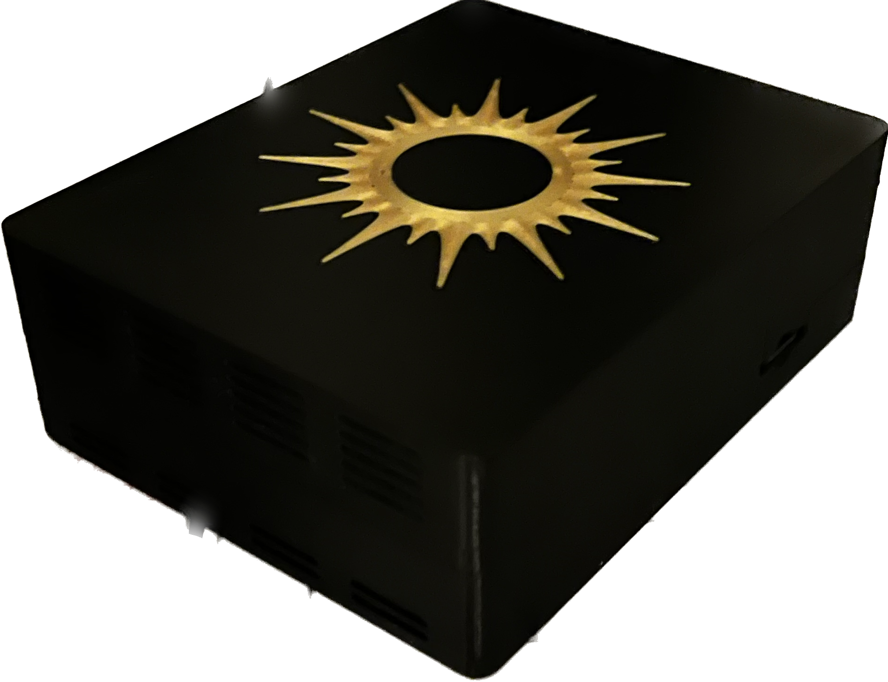
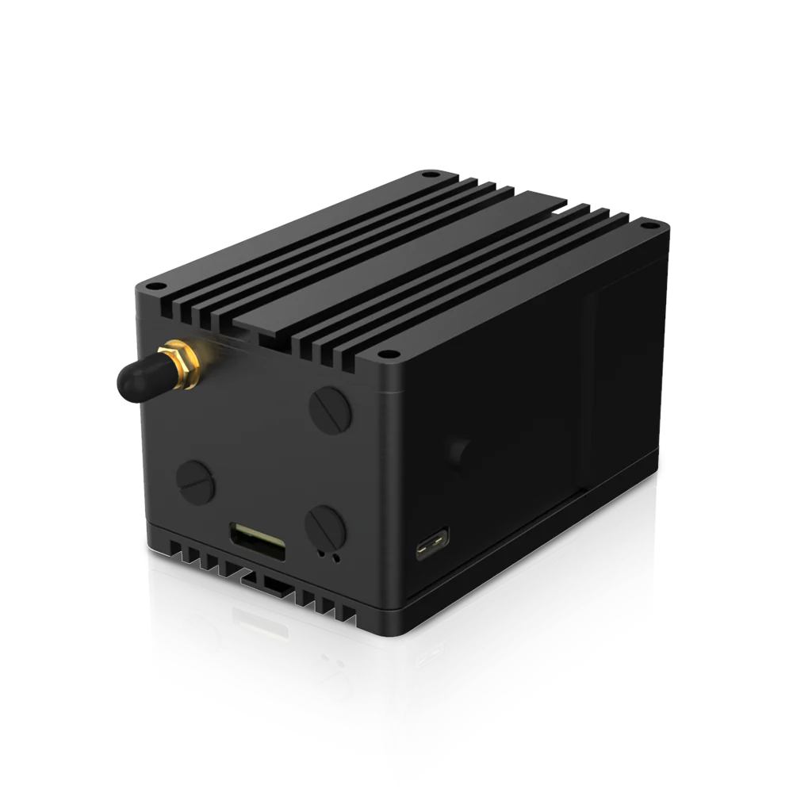

# Srcful Energy Gateway Firmware

This repository contains the Srcful Energy Gateway firmware and documentation. The firmware is compatible with the [Srcful PoS](https://docs.srcful.io/getting-started/using#proof-of-source) and [Helium PoC](https://docs.helium.com/iot/proof-of-coverage/).

## Getting Started

  <table style="border-collapse: collapse" width="150%">
    <tr>
      <td
        valign="top"
        width="50%"
        style="border: 5px solid grey; padding: 10px"
      >
        

           
          Srcful PoS compatible.    
          <a href="diy.md">Get started</a>
        

      </td>
      <td
        valign="top"
        width="50%"
        style="border: 5px solid grey; padding: 10px"
      >
        

           
          Srcful PoS and Helium PoC compatible.   
          <a href="diy-oss.md">Get started</a>
        

      </td>
    </tr>
  </table>

## Support

For any questions or issues, please refer to our [Support Guidelines](#) or open an issue in this repository.

## Contributing

We welcome contributions! Please refer to our [Contribution Guidelines](#) for more information on how you can contribute.

## Credits

Some of the images in this repository are maintained by [NebraLtd](https://github.com/NebraLtd/helium-miner-software).

## License

This repository is licensed under the [LICENSE NAME](#). Please read the license agreement carefully before using or contributing to this project.
